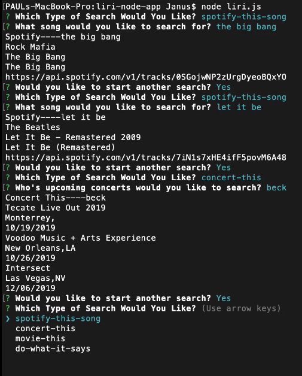

 # LIRI NODE APP
 
Licensing Information: READ LICENSE
---
Project source can be downloaded from https://github.com/lordpaulthomas/liri-node-app
----
Author
-----------
Paul Thomas

File List
---------
```
.:

.gitignore

LICENSE

README.md

keys.js

liri.js

log.txt

package-lock.json

package.json

random.txt
.:

```

Description of LIRI
-----------
LIRI is a **_Language_ Interpretation and Recognition Interface**

LIRI is a command line node app that will search:
* Spotify for songs
* Bands in Town for concerts
* OMDB for movies

To run this app you need to first download node.js to your computer.  You can do this here: 

https://nodejs.org/en/download/

Required node_modules
---------------------
``` axios ```

``` dotenv ```

``` express ```

``` inquirer ```

``` node-spotify-api ```

Example Video GIF
----------------------


Click image below to go to Full Example Video
----------------------
[](https://drive.google.com/file/d/1FYIqInarP1-wBoOGF9x3O88WpQcXgg5B/view)